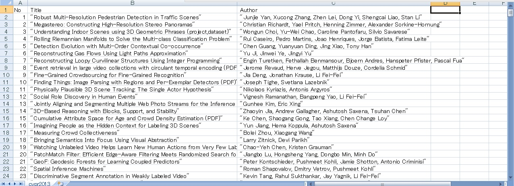

#ParseCVPapers.pl
Parsing cvpapers on the web (html->txt)

## Usage

1: Save HTML file on [CVPapers](http://www.cvpapers.com/index.html) (e.g.[cvpr2013](http://www.cvpapers.com/cvpr2013.html))
2: Change following IN/OUT variables

 > my $inHtml = "./cvpapers_cvpr2013.html";
 > my $outTxt = "./cvpr2013.txt";

3: Execute

 > chmod 755 ParseCVPapers.pl
 > perl ParseCVPapers.pl 

## Example

## Developer Environment

- Mac OS X 10.8.3
- Perl v5.12.4

